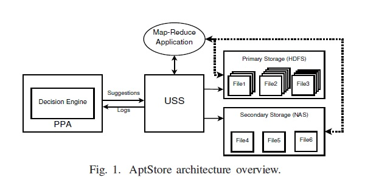

# Popularity Prediction Algorithm (PPA) for Aptstore : Dynamic Storage Management for Hadoop
PPA is used to predict the popularity of the files in the cluster. Decision Engine in Aptstore uses this information to decide which files are to be moved from primary to secondary storage and vice versa. It also decides on which files are to be replicated more. The most popular files can be replicated more and kept in primary storage for better i/o throughput. Likewise replication can be avoided for unpopular files and these files can be moved to the secondary storage. This will improve the storage efficiency in the hadoop. The concept of PPA is proposed in the paper mentioned in the reference. 

    

I have implemented the Popularity Prediction algorithm (PPA) in python. I have uploaded the source code in plain python file and in a Jupyter notebook which has all the simulated data and the results. Finally, I have displayed the results in bar graph for better visualization. I have also uploaded the ppt containing detailed information and usuage of the algorithm.

If any issue is found in my implementation, please let me know. Thanks for reading.

## Reference
K. R. Krish, A. Khasymski, A. R. Butt, S. Tiwari and M. Bhandarkar, "AptStore: Dynamic storage management for hadoop," 2013 IEEE International Conference on Cluster Computing (CLUSTER), 2013, pp. 1-5, doi: 10.1109/CLUSTER.2013.6702657.

