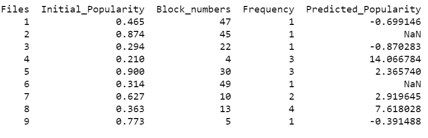

# Popularity Prediction Algorithm (PPA) for AptStore : Dynamic Storage Management for Hadoop

## Introduction
- Typical Hadoop setups employ Direct Attached Storage (**DAS**) with compute nodes and uniform replication of data to sustain high I/O throughput and fault tolerance. However, not all data is accessed at the same time or rate. Thus, if a large replication factor is used to support higher throughput for popular data, it wastes storage by unnecessarily replicating unpopular data as well. Conversely, if less replication is used to conserve storage for the unpopular data, it means fewer replicas for even popular data and thus lower I/O throughput.
- How can we achieve to improve the overall I/O throughput while reducing the storage cost?

<p align="center">
    
</p>

### AptStore : Dynamic Storage Management for Hadoop
AptStore is a dynamic data management system for Hadoop, which aims to improve overall I/O throughput while reducing storage cost. It is a tiered storage system that uses the standard Direct Attached Storage (DAS) (primary storage) for popular data to sustain high I/O throughput, and network attached storage (NAS) (secondary storage) for cost-effective, fault-tolerant, but lower-throughput storage for unpopular data. 

To determine how popular a file is, an algorithm is needed that can analyze the file system audit logs and predict the popularity of file. This is done by using a file **popularity prediction algorithm (PPA)**. At every RT (Reference time), the PPA analyzes the access pattern for each file and predicts a expected popularity value for it for the next RT.

## Problem Statement

In AptStore, a decision engine (DE) uses an algorithm to predict the expected popularity of files for the next reference time (RT) in the Hadoop cluster. This algorithm is called a **popularity prediction algorithm (PPA)**. Based on the predicted popularity score of the files, DE can suggest USS (Unified Storage System) on which files are to be kept in the primary storage and which ones to be kept in the secondary storage. It also gives insight to decide which files are to be replicated more and for which files replication is to be avoided. This decision helps in improving the i/o throughput as well as reducing the storage cost. **_Implement PPA which will predict the expected popularity of files using their initial popularity, access intervals, number of blocks and load in the cluster_**.

## Algorithm Analysis

The popularity value *P<sub>i+1</sub>(f)* of a file *f* varies with each access *i + 1* to the file. *P<sub>i+1</sub>(f)* is defined as:
<p align="center">
    
</p>

In the above formula, *c* is the popularity constant, *a(f)* is a function of the access interval of file *f*, *l* is the load in the cluster and *b(f)* is a function of number of blocks in the file f. During the creation of a file, the popularity of the file *P<sub>1</sub>(f)* is initialized to average file popularity observed in the system, AVG(P). Whenever a file is deleted, it will result in popularity of other files being modified when the values are updated at the end of RT. When a popular file is deleted, the popularity of other files in the system increases. Conversely, when an unpopular file is deleted, the popularity of other files decreases.

After the accesses of all files in the reference time RT are processed the popularity value *P<sub>i</sub>(f)* of a file f for the most recent access i is modified as follows:

 <p align="center">
    
</p>

MIP is the mean increase in the popularity of the file *f* during reference time RT, *AVG(P)* is the average popularity of all the files in the cluster, *s* is the scalability constant. The mean increase in popularity is a fraction of increase in popularity, IP during RT over F, the set of all files in the system. The scalability constant s is used to contract or expand the amount of data stored in primary storage. For a value of s greater than one, more data is pushed to primary, while a positive value of s, less than one, creates more space in the primary storage.

## Implementation Details

**I have implemented the PPA algorithm in Python using Dynamic Programming ( Bottom-Up Approach )**
```python
def predict_popularity(accessed_files, deleted_files, popularity,block_numbers, l, c, s, Pmin, Pmax):
    P = {}
    IP = 0
    Pred = {}
    avg_popularity = find_average_popularity(popularity)
    for f in set(accessed_files):
        P[f] = [0]
        
    for k in range(0, len(accessed_files)-1):
        f = accessed_files[k]
        i = len(P[f])-1
        
        if(i==0):
            P[f].append(avg_popularity)
            continue
        
        else:
            a = find_access_interval(f,k,accessed_files)
            b = find_block_numbers(f, block_numbers)
            calc = P[f][i] + c / (a*b*l*P[f][i])
            P[f].append(calc)
            
        if(P[f][i]<Pmin):
            P[f][i] = Pmin 
                    
        if(P[f][i]>Pmax):           
            P[f][i] = Pmax 
        
        IP = IP + P[f][i+1] - P[f][i]
                
    for f in deleted_files:
        IP = IP + avg_popularity - popularity[f]
        del P[f]
        del popularity[f]
        del block_numbers[f]
        
    MIP = IP / len(P)
 
    for f in P:
        i = len(P[f]) - 1
        P[f][i] = P[f][i] - MIP/s
        Pred[f] = P[f][i] + popularity[f]
        popularity[f] = P[f][i]       
        
    return Pred
```

- accessed_files : list of accessed files
- deleted_files : list of deleted files
- block_numbers : dictionary containing the number of blocks in files
- popularity:  dictionary containing the initial popularity of file
- l: load in the cluster
- c: popularity constant
- s: scalability constant
- P {}: dictionary of list to store the expected popularity of each access of each file
- P[i][f] = expected popularity of file f at ith access
- i = len(P[f])-1
- For i = 1, P[f][i] = average popularity in the cluster
- For i>1, P[f].append( P[f][i] + c / access_interval(f) * l * block_number(f) * P[f][i] ) 
- access_interval(f): the interval between current and last access of f
- block_numbers(f): number of blocks in file f
- Pred: dictionary to store expected predicted popularity of each file


## Simulation and Result

As I could not find the actual USS audit logs, I simulated the input data by randomly generating the values for accessed_files, deleted_files, popularity, block_numbers.
- accessed_files[] : list of randomly generated files from 1 to 9 for a random number 14 to 18.
- deleted_files[] : list of randomly chosen files from the accessed_files
- block_numbers{}: a dictionary that maps random number (1,50) to each unique file of accessed_files
- popularity{}: a dictionary that maps random number in the range of Pmin =0.1  to Pmax=0.9 ) each unique file of accessed_files
- c = 10000
- l = 9
- s = 5


### Sample Input Data simulation 
- Files are generated randomly and added to accessed_files list. 
- Some files were chosen randomly from the accessed_files and added to the deleted_files list
<p align="center">
    
</p>


- Now, for each unique file in accessed_file list, random values for initial popularity and number of blocks are generated
<p align="center">
    
</p>

### Result: Running PPA on Simulated Data
- Simulated data are fed into the PPA algorithm and expected popularity is obtained in the *Predicted_Popularity* column. **NaN** in *Predicted_Popularity* means the corresponding file has been deleted.
<p align="center">
    
</p>
<p align="center">
    
</p>

**Result Analysis:** File 4 has the highest value for the predicted_popularity as it has comparatively the least number of blocks and it has been accessed comparatively a greater number of times. Conversely, File 3 has the lowest value for the predicted_popularity as it has comparatively a greater number of blocks and it has been accessed only once. Also, its initial popularity is less.

### Visualization of Results

<p align="center">
        
</p>

## Other Resources
I have uploaded the following resources for PPA - 
- [Source Code](aptstore_popularity_prediction_algorithm.py)
- [Jupyter NoteBook](aptstore_popularity_prediction_algorithm.ipynb)
- [Report in PDF](ppa_report.pdf)
- [Powerpoint Presentation](ppa_ppt.pptx)


## Reference
K. R. Krish, A. Khasymski, A. R. Butt, S. Tiwari and M. Bhandarkar, "AptStore: Dynamic storage management for hadoop," 2013 IEEE International Conference on Cluster Computing (CLUSTER), 2013, pp. 1-5, doi: 10.1109/CLUSTER.2013.6702657.

## Feedback
If you find any issue in my implementation or documentation, please let me know. Thanks for reading.

